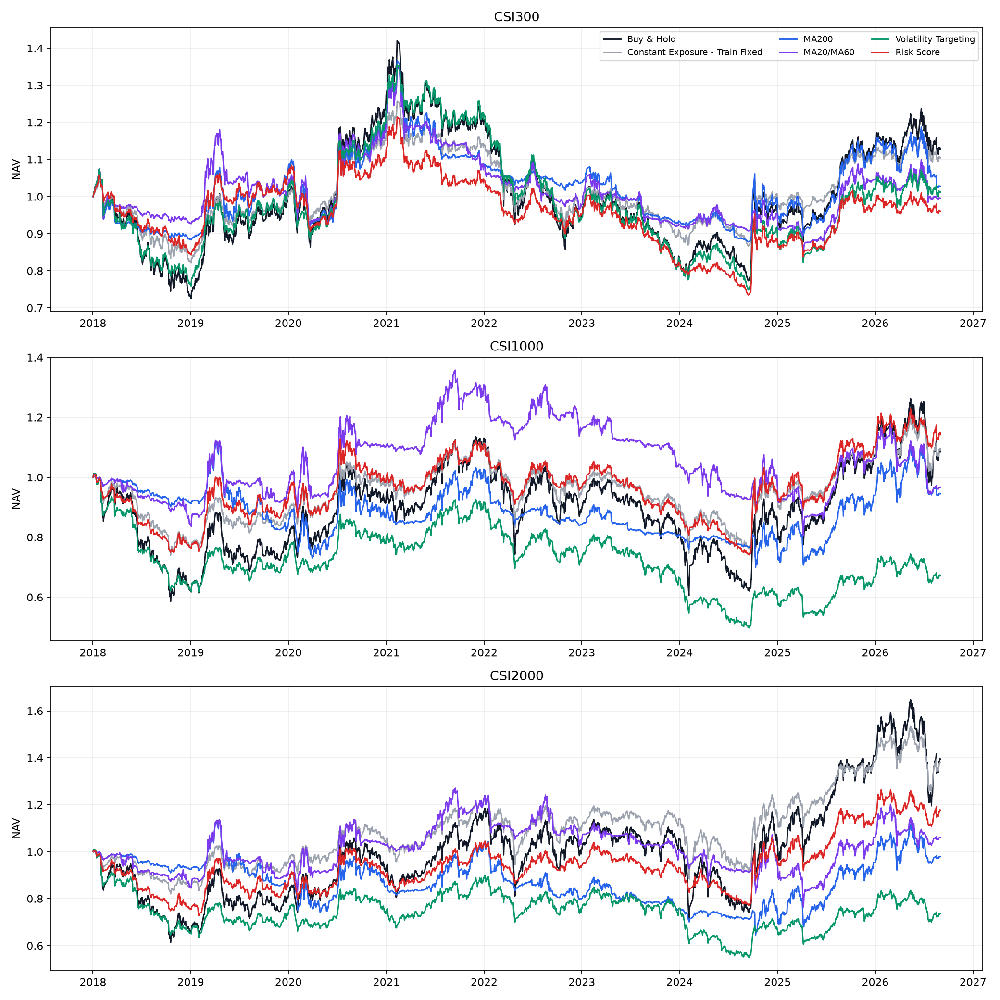
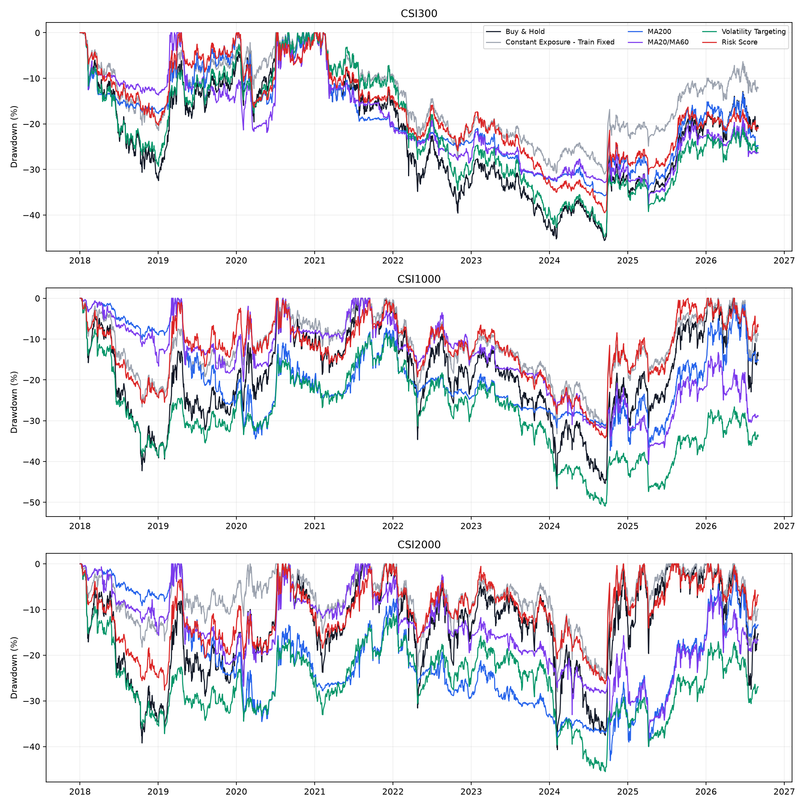
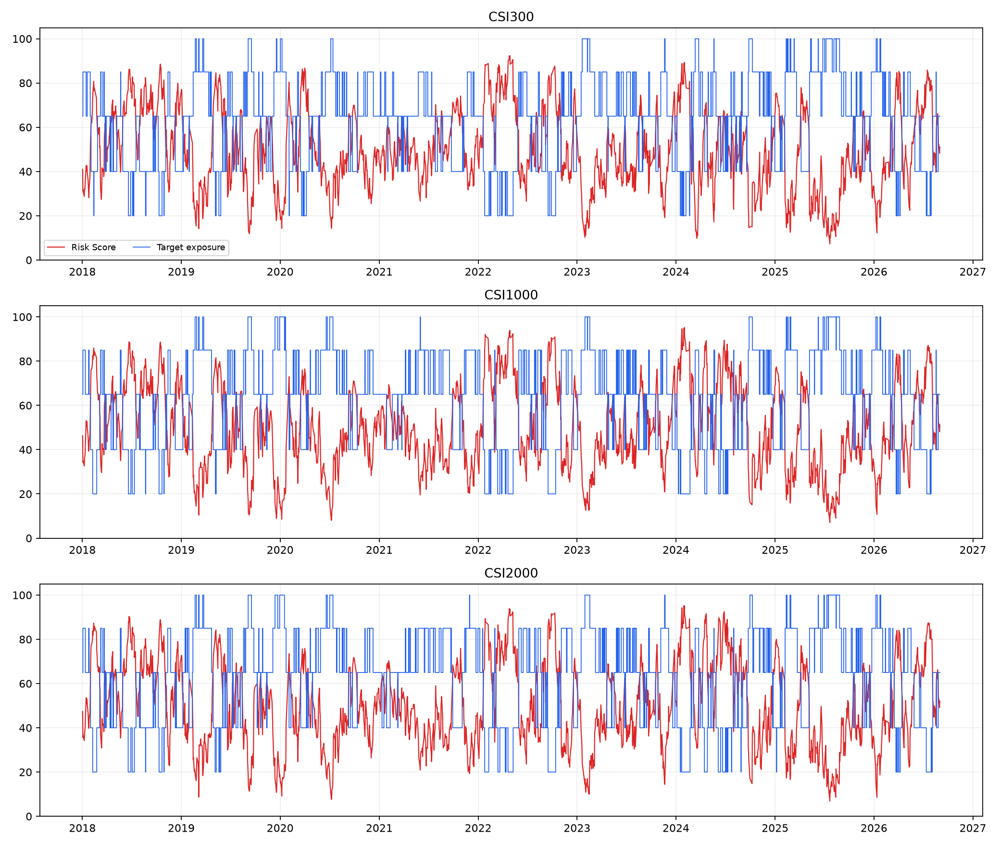

# Risk Score 仓位控制验证结果

运行区间：2018-01-02 至 2026-09-01；主成本：单边 5.0bp；执行：T日收盘信号，T+1开盘执行。

本报告是历史伪OOS研究，不是实时前瞻结果，也不代表可交易或可部署。指数使用价格指数，现金收益设为0。

## 核心结果

| 指数 | 策略 | CAGR | MaxDD | Calmar | Sharpe | 年化波动 | 下行捕获 | 最差完整年 | 恢复期 | 平均仓位 | 换手 |
| --- | --- | ---: | ---: | ---: | ---: | ---: | ---: | ---: | ---: | ---: | ---: |
| 沪深300 | Buy & Hold | 1.57% | 45.60% | 0.03 | 0.18 | 19.40% | 100.0% | -25.31% | 未恢复 | 100.00% | 0.00 |
| 沪深300 | Constant Exposure - Train Fixed | 1.15% | 31.03% | 0.04 | 0.16 | 12.24% | 62.8% | -17.14% | 未恢复 | 62.78% | 5.34 |
| 沪深300 | MA200 | 0.48% | 35.78% | 0.01 | 0.11 | 14.91% | 64.7% | -11.40% | 未恢复 | 63.33% | 58.08 |
| 沪深300 | MA20/MA60 | 0.11% | 38.29% | 0.00 | 0.08 | 13.68% | 58.1% | -10.56% | 未恢复 | 58.81% | 39.13 |
| 沪深300 | Volatility Targeting | 0.29% | 44.78% | 0.01 | 0.10 | 15.36% | 89.3% | -23.01% | 未恢复 | 84.27% | 35.52 |
| 沪深300 | Risk Score | -0.36% | 39.51% | -0.01 | 0.03 | 12.79% | 68.3% | -14.46% | 未恢复 | 63.19% | 99.25 |
| 中证1000 | Buy & Hold | 1.06% | 46.71% | 0.02 | 0.17 | 25.03% | 100.0% | -36.87% | 996日 | 100.00% | 0.00 |
| 中证1000 | Constant Exposure - Train Fixed | 0.99% | 33.21% | 0.03 | 0.14 | 15.52% | 63.0% | -23.10% | 996日 | 61.71% | 6.76 |
| 中证1000 | MA200 | -0.63% | 37.31% | -0.02 | 0.06 | 18.09% | 55.4% | -18.06% | 未恢复 | 61.40% | 56.12 |
| 中证1000 | MA20/MA60 | -0.38% | 40.71% | -0.01 | 0.07 | 17.41% | 53.6% | -15.22% | 未恢复 | 57.74% | 30.87 |
| 中证1000 | Volatility Targeting | -4.39% | 50.92% | -0.09 | -0.19 | 16.91% | 78.4% | -36.81% | 未恢复 | 71.22% | 47.22 |
| 中证1000 | Risk Score | 1.63% | 34.21% | 0.05 | 0.18 | 15.98% | 59.7% | -22.80% | 1270日 | 63.06% | 99.04 |
| 中证2000 | Buy & Hold | 4.01% | 40.70% | 0.10 | 0.29 | 26.61% | 100.0% | -33.34% | 772日 | 100.00% | 0.00 |
| 中证2000 | Constant Exposure - Train Fixed | 3.80% | 28.05% | 0.14 | 0.32 | 16.20% | 60.1% | -15.16% | 702日 | 59.97% | 6.99 |
| 中证2000 | MA200 | -0.22% | 43.09% | -0.01 | 0.09 | 19.42% | 61.3% | -22.53% | 未恢复 | 66.23% | 59.26 |
| 中证2000 | MA20/MA60 | 0.70% | 39.90% | 0.02 | 0.13 | 18.87% | 54.9% | -15.14% | 未恢复 | 60.11% | 37.22 |
| 中证2000 | Volatility Targeting | -3.38% | 45.50% | -0.07 | -0.12 | 17.07% | 79.0% | -34.15% | 未恢复 | 68.14% | 47.75 |
| 中证2000 | Risk Score | 1.96% | 27.66% | 0.07 | 0.21 | 16.48% | 61.9% | -23.94% | 609日 | 62.96% | 98.08 |

## 三个问题

- **沪深300**：相对Buy & Hold，MaxDD相对减少13.4%，CAGR差-1.93个百分点；相对Train Fixed等仓位基线，没有同时改善Calmar与MaxDD；相对MA200和波动率目标，Risk Score未能同时胜过两项简单基线。
- **中证1000**：相对Buy & Hold，MaxDD相对减少26.7%，CAGR差0.57个百分点；相对Train Fixed等仓位基线，没有同时改善Calmar与MaxDD；相对MA200和波动率目标，Risk Score同时胜过两项简单基线。
- **中证2000**：相对Buy & Hold，MaxDD相对减少32.0%，CAGR差-2.05个百分点；相对Train Fixed等仓位基线，没有同时改善Calmar与MaxDD；相对MA200和波动率目标，Risk Score同时胜过两项简单基线。

1. **相比Buy & Hold**：中证1000和中证2000达到预设的明显降回撤门槛，沪深300没有；三指数结论不一致。
2. **相比简单风控**：Risk Score在中证1000和中证2000优于MA200与波动率目标，但在沪深300失败，因此没有形成跨风格一致优势。
3. **相比相同平均仓位**：三个指数均未同时改善Train Fixed的MaxDD与Calmar，当前没有足够证据证明择时增量。

问题1按回撤相对减少至少20%且绝对减少至少3个百分点判断是否明显；问题2要求逐项优于简单风控；问题3以Train Fixed为正式OOS对照，Full Sample只在诊断文件中使用。统计区间见robustness.csv，压力事件见stress_events.csv。

## 中证2000发布后诊断

中证2000于2023-08-11发布。发布后至样本末只有约3年，仅作为补充，不替代全区间主结论。

| 策略 | CAGR | MaxDD | Calmar | 平均仓位 |
| --- | ---: | ---: | ---: | ---: |
| Buy & Hold | 9.61% | 36.40% | 0.26 | 100.00% |
| Constant Exposure - Train Fixed | 6.53% | 24.87% | 0.26 | 62.28% |
| MA200 | 7.36% | 20.53% | 0.36 | 68.59% |
| MA20/MA60 | 0.86% | 28.70% | 0.03 | 62.65% |
| Volatility Targeting | -1.91% | 31.01% | -0.06 | 63.12% |
| Risk Score | 7.55% | 20.63% | 0.37 | 61.18% |

发布后Risk Score的CAGR为7.55%、MaxDD为20.63%、Calmar为0.37，较Train Fixed同时改善；但与MA200接近，且样本期过短，不能升级为跨周期择时证据。

## 主要限制

- 五维底层指标是本次冻结的第一版工程定义，未做权重、窗口或阈值搜索；结论只对应这一实现。
- 中证2000在2023-08-11发布，之前为供应商提供的回溯价格；发布后样本很短，不能单凭其全区间结果称为实时可投资证据。
- 使用指数价格序列和假设摩擦，没有包含ETF跟踪误差、期货展期、真实容量和现金利息。
- 市场横截面由当日有有效行情的A股组成，保留历史退市证券；停牌证券当日无新行情，因此不进入当日横截面。
- 滚动块Bootstrap是路径不确定性的近似诊断，不增加危机事件数量，也不能替代未来样本。

## 图表

